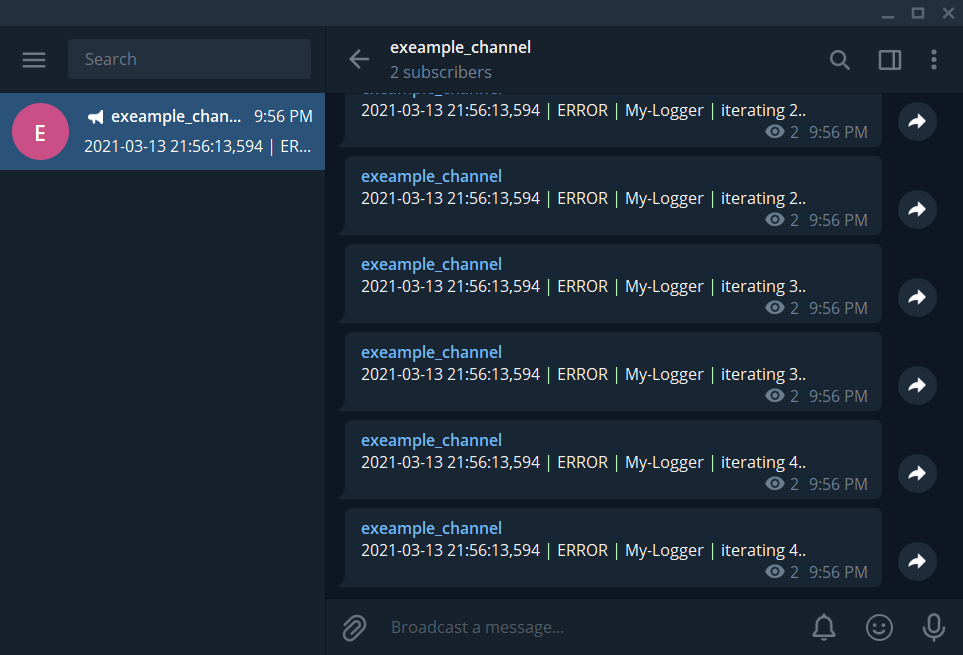

# telegram_handler
Logging handler that sends log messages directly to either a telegram channel or chat  

## Motivation
Tracking program execution state remotely - directly from your telegram account

## Screenshots


## Code Examples
Basic usage example:
```python
import logging

from telegram_handler import AsyncTelegramHandler

BOT_TOKEN = '1612485124:AAFW9JXxjqY9d-XayMKh8Q4-_iyHkXSw3N8'
CHANNEL_NAME = 'example_channel_logger'


def main():
    telegram_log_handler = AsyncTelegramHandler(BOT_TOKEN, CHANNEL_NAME)
    my_logger = logging.getLogger('My-Logger')
    my_logger.setLevel(logging.INFO)
    my_logger.addHandler(logging.StreamHandler())
    my_logger.addHandler(telegram_log_handler)

    for i in range(5):
        my_logger.error(f'iterating {i}..')


if __name__ == '__main__':
    main()
```

Another option is to add the handler to the root logger:
```python
import logging

from telegram_handler import AsyncTelegramHandler

BOT_TOKEN = '1612485124:AAFW9JXxjqY9d-XayMKh8Q4-_iyHkXSw3N8'
CHANNEL_NAME = 'example_channel_logger'


def main():
    telegram_log_handler = AsyncTelegramHandler(BOT_TOKEN, CHANNEL_NAME)
    logging.basicConfig(
        handlers = [
            telegram_log_handler
        ],
        level=logging.INFO,
        format='%(asctime)s | %(levelname)s | %(name)s | %(message)s'
    )
    my_logger = logging.getLogger('My-Logger')
    for i in range(5):
        my_logger.error(f'iterating {i}..')


if __name__ == '__main__':
    main()

```

## Installation
`pip install telegram-handler`

## Preparation
In order to use the package you should:
- Create a bot, you can see how this is being done
  [here](https://core.telegram.org/bots#3-how-do-i-create-a-bot).
- Create a channel, you can see how this is being done
  [here](https://www.logaster.com/blog/how-create-telegram-channel/).

## How to use?
### There are 2 possibilities:
- Use `AsyncTelegramHandler` and send messages from a different thread (__recommended__)
- Use `BlockingTelegramHandler` and send messages from the same thread.  
  :warning: __warning__: sometimes the logger should wait for a cooldown (telegram constrains),
  using this handler will block the entire program
  
### Parameters:
- `bot_token` - The token that returns from the `BotFather` when creating the bot.  

- `channel_name` - Each chat in Telegram have `chat id`. 
  - channel name is the `chat id` for public channels. 
    So for the __public channel__ `example_channel_logger` the `chat id` will be `example_channel_logger`
  - The `channel_name` can be any `chat id`, you can see how to obtain chat id 
    [here](http://techblog.sillifish.co.uk/2020/03/30/telegram-chat-id-and-token-id/).
